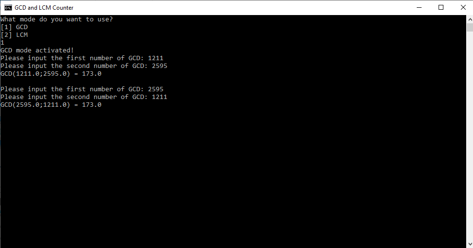
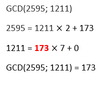
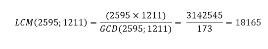
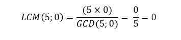

# GCD and LCM Counter 

Welcome to GCD and LCM Python file counter. This file helps you to count GCD and LCM very fast than you do! <a href="./main.py" download>Download file here</a>.

### How to use

Please follow these steps one by one:

1. Run "run.bat" <u>or</u> "main.py" files.
2. You will get a message with "What mode do you want to use?" and 2 modes with numbers.
3. You have to choose one of those modes.
   - If you want to count GCD equation or select that mode, type: "1" or "GCD".
   - if you want to count LCM equation or select that mode, type: "2" or "LCM".
4. After input the first number of GCD or LCM.
5. Then input the second number of GCD or LCM.
6. Done! You will get results of your operation!

**NOTE**: Inputs are not case-sensitive. 

### Examples

Here is examples of GCD & LCM counter file:

**GCD Examples**:

- GCD(2595; 1211) = GCD(1211; 2595) = **173**
- GCD(5; 0) = GCD(0; 5) = **5**

**Proof**:

> GCD(2595; 1211)

> GCD(5; 0) or GCD(0; 5)

Every first or second number on GCD and equals 0. Then GCD equals the other number. Example:

GCD(a; b)
but: **b = 0** and **a > 0**
Then: GCD(a; b) = **a**

Here is example: **GCD(5; 0) = 5**

**LCM Examples**:

- LCM(2595; 1211) = LCM(1211; 2595) = **18165**
- LCM(5; 0) = LCM(0; 5) = **0**

**Proof**:

> LCM(2595; 1211) or LCM(1211; 2595)

> LCM(5; 0) or LCM(0; 5)

### REQUIREMENTS

That all you need is:
- Python (Software)

**No modules needed for now.**

**NOTE**: screenshots can be for old versions of this python file. We do not change screenshots every updates.

**Another note**: there is only 1 language available on this file for now and it is: English.

Any mistake in grammar, spelling and counting. Please report at our Discord server.

------

**Version**: v1.0 - **Developed and created by**: *yasserprogamer*